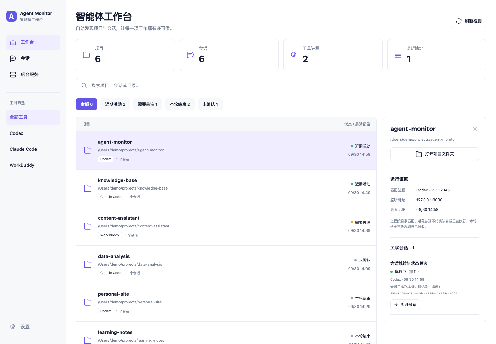

# Agent Monitor Skill · 多智能体任务监测

在 macOS 上查看 **Codex、Claude Code、WorkBuddy** 的项目、会话、进程与监听端口，并让智能体根据证据解释“哪些还在跑”。



> 上图来自[配套 Obsidian 插件](https://github.com/zackzhangkai/obsidian-agent-monitor)，使用虚构数据。本仓库提供 Skill 和命令行检测器；安装 Skill 不会自动安装图形插件。

## 能做什么

- 自动发现最近的本地会话，按项目目录整理。
- 同时查看工具进程与 TCP 监听地址。
- 输出 JSON 快照及 Obsidian 可读的 Markdown 工作台。
- 保留状态证据，区分“一轮已结束”“近期活动”“状态未确认”。

**进程存活不代表任务正在执行；一轮响应结束不代表项目已验收。**

## 安装 Skill

需要 macOS、Python 3.9+ 和 Git；Python 仅使用标准库。

```sh
git clone https://github.com/zackzhangkai/agent-monitor-skill.git
```

Codex 安装：

```sh
mkdir -p ~/.codex/skills
cp -R agent-monitor-skill/skills/agent-monitor ~/.codex/skills/
```

Claude Code 安装：

```sh
mkdir -p ~/.claude/skills
cp -R agent-monitor-skill/skills/agent-monitor ~/.claude/skills/
```

如果已有同名目录，先检查本地修改，再选择更新方式。重新启动工具后，请求：

> 使用 agent-monitor，检查最近 14 天的智能体项目，列出需要关注的会话和仍在监听的服务。

检测器支持读取 WorkBuddy 的本地记录；这里不声明 WorkBuddy 支持安装该 Skill。

## 直接生成 Obsidian 工作台

在克隆的仓库目录运行，将路径替换成自己的 Vault：

```sh
python3 skills/agent-monitor/scripts/monitor.py \
  --vault "/path/to/your/vault" \
  --output-dir "/path/to/your/vault/AgentMonitor" \
  --days 14
```

生成 `自动监测.md`、`snapshot.json` 和 `.monitor.lock`。一次运行检测一次；如需每 30 秒更新，可在终端运行：

```sh
while true; do
  python3 skills/agent-monitor/scripts/monitor.py \
    --vault "/path/to/your/vault" \
    --output-dir "/path/to/your/vault/AgentMonitor" --days 14
  sleep 30
done
```

按 **Ctrl+C** 停止。扫描耗时另计；不安装开机服务。图形看板与 Obsidian 内自动刷新请使用[配套插件](https://github.com/zackzhangkai/obsidian-agent-monitor)。

## 数据来源与边界

| 来源 | 读取内容 |
| --- | --- |
| Codex | `~/.codex/state_5.sqlite` 及数据库引用的 rollout 日志尾部 |
| Claude Code | `~/.claude/projects/*/*.jsonl` 的近期会话元数据及事件 |
| WorkBuddy | `~/.workbuddy/workbuddy.db` 的会话状态 |
| macOS | `ps` 进程信息、`lsof` 工作目录及 TCP 监听地址 |

每个来源最多读取 300 个近期会话；默认历史窗口 14 天。数据库采用只读连接，不修改会话、配置或原有笔记，不停止进程，不发送网络请求。应用未安装或数据库结构变化时，会显示读取错误，其余来源仍继续检测。

输出包含真实项目路径与会话标题，请勿提交真实快照或私人截图。日志解析可能读到尾部片段中的对话正文，但输出不包含正文或工具命令参数。时间按北京时间（UTC+8）显示。目前不支持 Windows/Linux。

## 开发与贡献

```sh
python3 -m unittest discover -s tests -v
```

Skill 位于 `skills/agent-monitor/`。欢迎通过 [Issues](https://github.com/zackzhangkai/agent-monitor-skill/issues) 报告匿名化的兼容问题，或提交 PR 改进解析、状态证据与使用说明。测试与示例请使用虚构数据。

## 联系与交流

- 个人微信：`zack6116`
- X：[@kaiz_amm](https://x.com/kaiz_amm)

### 个人微信


### AI 学习交流圈


当前交流群二维码有效期截至 **2026-10-07**；失效后可添加个人微信索取新二维码。飞书群尚未建立，入口待补充。

## License

[MIT](LICENSE)。独立社区项目，与 OpenAI、Anthropic、腾讯及 Obsidian 无隶属关系。
